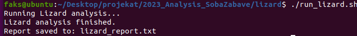
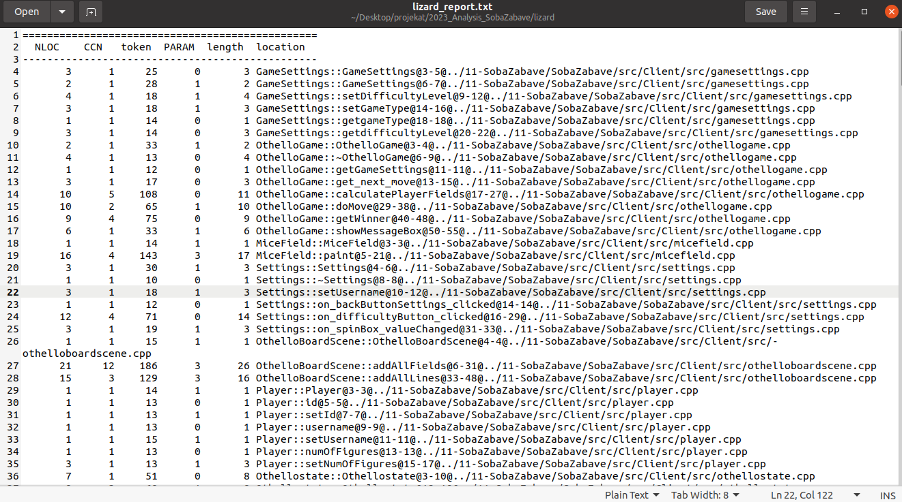
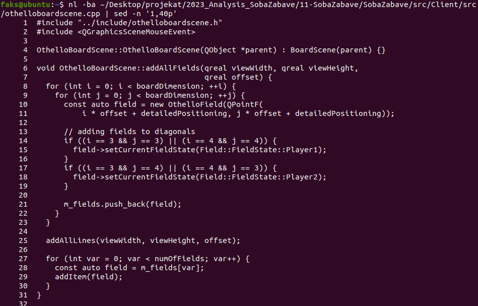
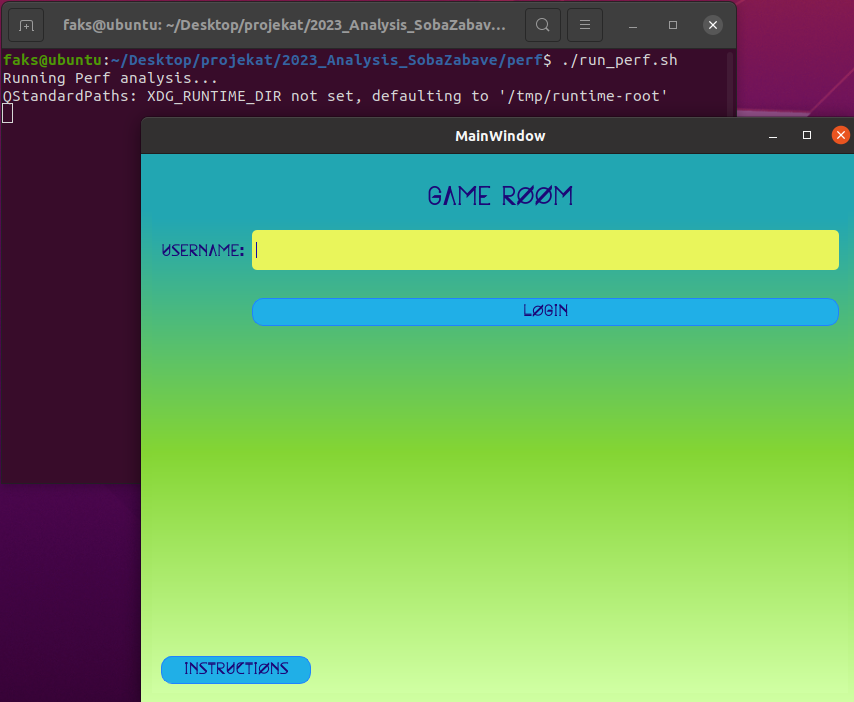
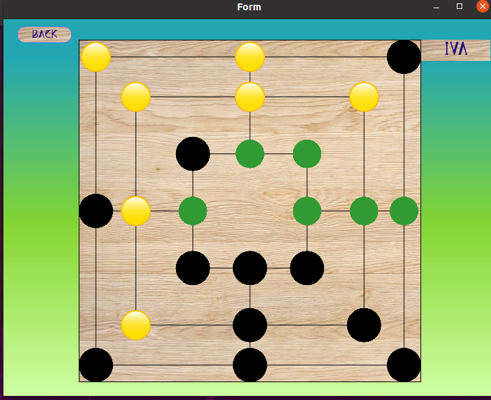
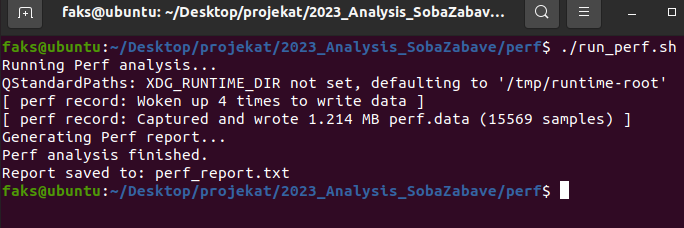
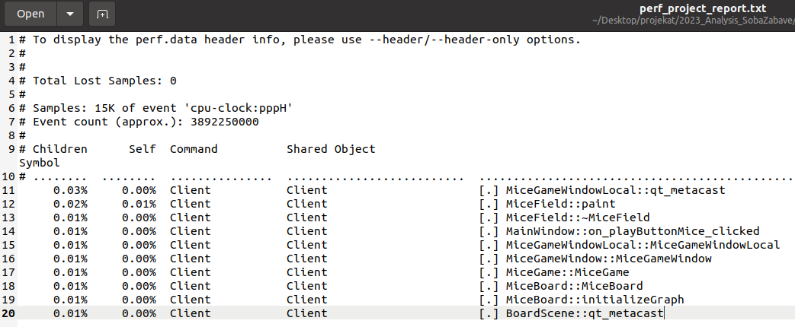
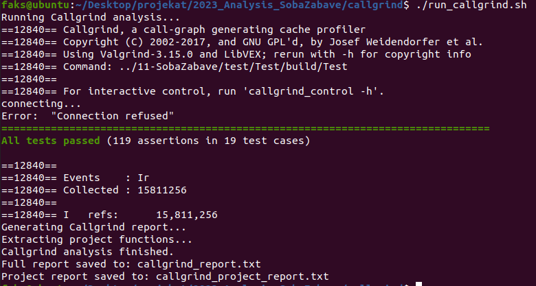
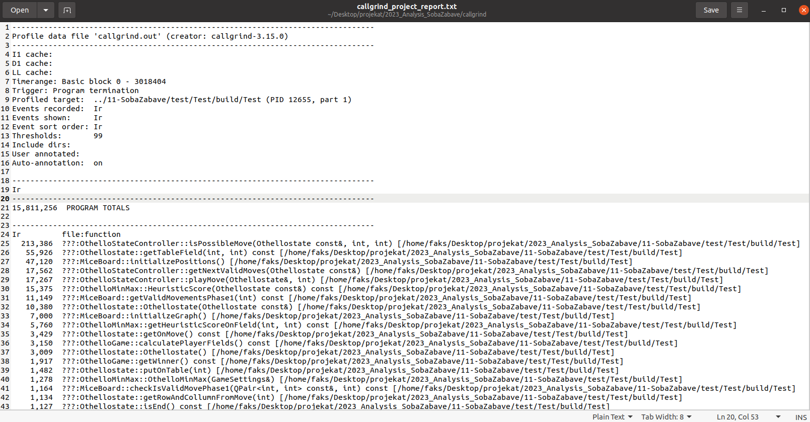
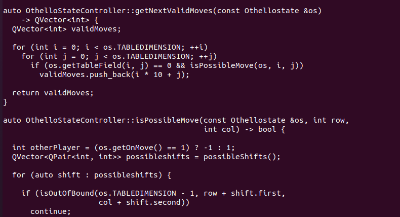

# Analiza projekta SobaZabave


## Sadržaj

1. [Uvod](#1-uvod)
2. [Statička analiza koda](#2-statička-analiza-koda)
   - 2.1 [Cppcheck](#21-cppcheck)
   - 2.2 [Clazy](#22-clazy)
3. [Analiza kompleksnosti — Lizard](#3-analiza-kompleksnosti--lizard)
4. [Profilisanje performansi — Perf](#4-profilisanje-performansi--perf)
5. [Profilisanje performansi — Callgrind](#5-profilisanje-performansi--callgrind)
6. [Analiza memorije — Heaptrack](#6-analiza-memorije--heaptrack)
7. [Zaključak](#7-zaključak)

---

## 1. Uvod

U ovom radu prikazana je analiza projekta **SobaZabave** primenom različitih alata i tehnika za verifikaciju softvera. Projekat je razvijen u programskom jeziku C++ korišćenjem Qt radnog okvira, a nastao je u okviru kursa Razvoj softvera na Matematičkom fakultetu Univerziteta u Beogradu.

SobaZabave je aplikacija koja omogućava igranje dve igre — **Othello** i **Mice**. Igre se mogu igrati lokalno, protiv računara ili u multiplayer režimu. Projekat se sastoji od klijentskog i serverskog dela, a pored implementacije logike igara sadrži grafički korisnički interfejs i mrežnu komunikaciju.

Izvorni projekat dostupan je na adresi:

`https://gitlab.com/matf-bg-ac-rs/course-rs/projects-2021-2022/11-SobaZabave`

U okviru repozitorijuma za analizu originalni projekat je dodat kao Git podmodul. Analizirana je verzija projekta sa commit-a:

`b7cae8fb7cd0f705bed87ae4215824c71081000a`

Pre početka analize provereno je da projekat može uspešno da se prevede i pokrene.


Za analizu projekta biće korišćeno više alata i tehnika kojima će biti obuhvaćeni statička analiza koda, dinamička analiza, profilisanje performansi i analiza kompleksnosti.

---

## 2. Statička analiza koda

Statička analiza koda omogućava pronalaženje potencijalnih problema bez pokretanja programa. Ovakvom analizom mogu se uočiti greške u kodu, korišćenje neinicijalizovanih promenljivih, sumnjive konstrukcije, kao i problemi koji se odnose na stil i kvalitet koda.

U okviru ovog rada za statičku analizu korišćeni su alati **Cppcheck** i **Clazy**.

---

## 2.1 Cppcheck

Prvi alat korišćen za analizu projekta je **Cppcheck**. U pitanju je alat za statičku analizu C i C++ koda koji može da pronađe potencijalne greške bez pokretanja programa. Pored grešaka, prijavljuje i različita upozorenja koja se odnose na stil i kvalitet koda.

Za analizu je korišćena verzija **1.90**.

Analiza je automatizovana skriptom `run_cppcheck.sh`:

```bash
#!/bin/bash

CPPCHECK_OPTIONS="--enable=all --inconclusive --suppress=missingIncludeSystem"

DIRECTORY_TO_CHECK="../11-SobaZabave/SobaZabave"

cppcheck $CPPCHECK_OPTIONS "$DIRECTORY_TO_CHECK" 2> cppcheck_report.txt
```

Opcija `--enable=all` uključuje sve grupe provera koje Cppcheck nudi, dok `--inconclusive` omogućava prikaz i rezultata za koje alat ne može sa potpunom sigurnošću da utvrdi da predstavljaju problem. Opcija `--suppress=missingIncludeSystem` korišćena je da se iz rezultata uklone upozorenja vezana za sistemska zaglavlja.

Rezultat analize čuva se u fajlu `cppcheck_report.txt`.


*Slika 1: Pokretanje Cppcheck analize*

### Duplirani uslov

Jedan od značajnijih rezultata analize je upozorenje `duplicateCondition`. Cppcheck je u fajlu `micegame.cpp` prijavio da se na linijama 88 i 92 nalazi isti uslov.


*Slika 2: Upozorenje za duplirani uslov*

Proverom prijavljenog dela izvornog koda vidi se da oba uslova proveravaju broj figura drugog igrača:

```cpp
if (m_player2->numOfFigures() == 3) {
    m_player1->setPhase(MicePlayer::Phase::Phase2);
}

if (m_player2->numOfFigures() == 3) {
    m_player2->setPhase(MicePlayer::Phase::Phase2);
}
```


*Slika 3: Deo funkcije `tryToChangePhase` sa dupliranim uslovom*

U prvom slučaju proverava se broj figura igrača `m_player2`, dok se faza menja igraču `m_player1`. U drugom slučaju i provera i promena faze odnose se na `m_player2`. Na osnovu ostatka implementacije faza igre, prvi uslov bi trebalo da proverava broj figura prvog igrača:

```cpp
if (m_player1->numOfFigures() == 3) {
    m_player1->setPhase(MicePlayer::Phase::Phase2);
}
```

Na ovaj način Cppcheck je ukazao na grešku u uslovu koja može da dovede do pogrešne promene faze prvog igrača.

### Neinicijalizovane promenljive

Cppcheck je prijavio i nekoliko članova klase `Client` koji nisu inicijalizovani u konstruktoru. U pitanju su promenljive `yourTurn`, `client1_ind` i `client2_ind`.


*Slika 4: Cppcheck upozorenja za neinicijalizovane članove klase `Client`*

Proverom konstruktora klase `Client` vidi se da se u njemu inicijalizuje objekat `socket`, dok navedeni članovi nemaju početne vrednosti.

```cpp
Client::Client(QObject *parent) : QObject(parent) {
    socket = new QTcpSocket(this);
}
```


*Slika 5: Konstruktor klase `Client`*

Neinicijalizovane promenljive mogu imati neodređene vrednosti sve dok im se eksplicitno ne dodeli vrednost, pa njihovo korišćenje pre dodele može dovesti do neočekivanog ponašanja programa. Zbog toga bi bilo bolje inicijalizovati ih prilikom konstrukcije objekta.

### Ostala upozorenja

Pored prethodno izdvojenih rezultata, Cppcheck je prijavio i veći broj upozorenja manjeg značaja. Neka od njih odnose se na konstruktore sa jednim argumentom koji nisu označeni kao `explicit`, funkcije koje bi mogle biti označene kao `const` ili `static`, kao i na nepotrebno kopiranje i promenljive čija se vrednost ne koristi.

Prijavljena su i upozorenja za još nekoliko neinicijalizovanih članova, među kojima su `m_moveIndicator`, `m_source` i `m_destination` u klasi `MiceGame`, kao i `m_numOfFigures` u klasi `Player`.

Deo prijavljenih rezultata odnosi se na stil i moguće poboljšanje kvaliteta koda i ne predstavlja nužno grešku u radu programa. Zbog toga su u prethodnim delovima detaljnije analizirana dva nalaza koja su ocenjena kao značajnija.

### Zaključak Cppcheck analize

Cppcheck analiza je pokazala više upozorenja različitog značaja. Pored preporuka vezanih za stil koda, pronađen je duplirani uslov u implementaciji igre Mice, čijom proverom je uočena greška u izboru igrača čiji se broj figura proverava. Takođe su pronađeni članovi klase `Client` koji nisu inicijalizovani u konstruktoru.

Ovi rezultati pokazuju da statička analiza može da ukaže na potencijalne probleme u kodu bez potrebe za pokretanjem same aplikacije.

---

## 2.2 Clazy

Drugi alat korišćen za statičku analizu je **Clazy**, statički analizator zasnovan na Clang-u koji je namenjen pronalaženju problema specifičnih za Qt aplikacije. U analizi je korišćena verzija **1.6**.

Clazy je pokrenut kao kompajler tokom izgradnje klijentskog dela projekta. Na taj način se analiza izvršava zajedno sa prevođenjem izvornog koda.

Za pokretanje analize korišćena je sledeća skripta:

```bash
#!/bin/bash

REPORT_FILE="$(pwd)/clazy_report.txt"
TEMP_REPORT="$(pwd)/temp_report.txt"

cd ../11-SobaZabave/SobaZabave/src/Client

echo "Cleaning old build..."
rm -rf build_clazy

echo "Removing old reports..."
rm -f "$REPORT_FILE"
rm -f "$TEMP_REPORT"

export CLAZY_CHECKS="level1"

mkdir build_clazy
cd build_clazy

echo "Running qmake with Clazy..."
qmake ../Client.pro QMAKE_CXX=clazy QMAKE_CC=clang

echo "Building project with Clazy analysis..."
make -j$(nproc) 2> "$TEMP_REPORT"

echo "Saving Clazy warnings..."
grep -E "warning:|clazy" "$TEMP_REPORT" > "$REPORT_FILE"

echo "Clazy analysis finished."
echo "Report saved to: $REPORT_FILE"
```

Kompletan izlaz analize čuva se u fajlu `temp_report.txt`, dok se izdvojena upozorenja čuvaju u fajlu `clazy_report.txt`.


*Slika 6: Pokretanje Clazy analize i uspešno kreiranje izveštaja*

### Iteriranje kroz Qt kontejnere

Clazy je prijavio upozorenja u fajlu `boardscene.cpp` na linijama 6 i 11, na mestima gde se koristi range-based `for` petlja nad `QVector` kontejnerima.


*Slika 7: Clazy upozorenja za iteriranje kroz `QVector` kontejnere*

Proverom prijavljenih linija izvornog koda vidi se da se upozorenja odnose na sledeće dve petlje:

```cpp
for (auto field : m_fields) {
    delete field;
}

for (auto line : m_lines) {
    delete line;
}
```


*Slika 8: Deo destruktora klase `BoardScene` na koji se odnose Clazy upozorenja*

Clazy upozorava da ovakav način iteriranja može dovesti do odvajanja (*detach*) Qt kontejnera i potencijalno nepotrebnog kopiranja podataka. Ovo upozorenje ne predstavlja nužno funkcionalnu grešku, već ukazuje na potencijalno neefikasno korišćenje Qt kontejnera.

### Implicitna konverzija tipova

Još jedno korisno upozorenje pronađeno je u fajlu `othelloboardscene.h`. U kodu se nalazi sledeća deklaracija:

```cpp
const int detailedPositioning = 3.6;
```

Promenljiva `detailedPositioning` deklarisana je kao `int`, dok joj se dodeljuje decimalna vrednost `3.6`. Prilikom implicitne konverzije decimalni deo se odbacuje, tako da vrednost promenljive postaje `3`.

Ukoliko je namera autora bila da se sačuva vrednost `3.6`, promenljiva bi mogla biti deklarisana korišćenjem tipa `double`:

```cpp
const double detailedPositioning = 3.6;
```

Ovaj nalaz predstavlja potencijalni gubitak preciznosti i pokazuje mesto u kodu koje bi trebalo dodatno proveriti u odnosu na nameravano ponašanje programa.


### Ostala upozorenja

Clazy je prijavio i veći broj upozorenja vezanih za Qt slotove čija imena odgovaraju obrascu `on_foo_bar`. U izveštaju se za ovakve slotove pojavljuje upozorenje `connect-by-name`, uz napomenu da ovakav način povezivanja može biti podložan greškama. Ova upozorenja pojavljuju se u više klasa korisničkog interfejsa, među kojima su `MiceGameWindow`, `OthelloGameWindow`, `Settings` i `MainWindow`.

Pored toga, prijavljena su i upozorenja za neiskorišćene parametre u pojedinim funkcijama i način inicijalizacije pojedinih objekata. Ova upozorenja uglavnom predstavljaju preporuke za poboljšanje kvaliteta i održivosti koda i nisu detaljnije analizirana.

### Zaključak Clazy analize

Clazy analiza je pokazala nekoliko potencijalnih problema i preporuka specifičnih za Qt kod. Kao najzanimljiviji nalazi izdvojeni su potencijalno neefikasno iteriranje kroz Qt kontejnere i implicitna konverzija vrednosti `3.6` u celobrojni tip. Projekat je tokom Clazy analize uspešno preveden, a pronađena upozorenja ukazuju na mesta u kodu koja bi mogla biti unapređena.

---
## 3. Analiza kompleksnosti — Lizard

Za analizu kompleksnosti koda korišćen je alat **Lizard**. Ovaj alat računa različite metrike izvornog koda, među kojima su broj linija koda (NLOC), broj parametara i ciklomatska kompleksnost (CCN).

Za analizu je korišćena verzija **1.24.0**, koja je instalirana pomoću `pip3`.

Analiza je automatizovana skriptom `run_lizard.sh`:

```bash
#!/bin/bash

REPORT_FILE="lizard_report.txt"

echo "Running Lizard analysis..."

lizard \
    ../11-SobaZabave/SobaZabave/src/Client/src \
    ../11-SobaZabave/SobaZabave/src/Client/include \
    ../11-SobaZabave/SobaZabave/src/Server/src \
    ../11-SobaZabave/SobaZabave/src/Server/include \
    > "$REPORT_FILE"

echo "Lizard analysis finished."
echo "Report saved to: $REPORT_FILE"
```

Analizirani su izvorni i zaglavni fajlovi klijentskog i serverskog dela projekta, a rezultat analize čuva se u fajlu `lizard_report.txt`.



*Slika 9: Pokretanje Lizard analize*

### Rezultati analize

Lizard je analizirao ukupno **51 fajl** i pronašao **188 funkcija**. Ukupan broj linija koda koje alat računa kao NLOC iznosi **2038**, dok je prosečna ciklomatska kompleksnost funkcija **2.0**.

Nijedna funkcija nije prekoračila podrazumevani Lizard prag za ciklomatsku kompleksnost, koji iznosi **CCN > 15**, pa alat nije prijavio upozorenja.



*Slika 10: Rezultat Lizard analize*

Iako prag nije prekoračen, funkcija sa najvećom ciklomatskom kompleksnošću u analiziranom kodu je `OthelloBoardScene::addAllFields`, za koju je dobijena vrednost **CCN = 12**.

### Funkcija sa najvećom kompleksnošću

Proverom funkcije `OthelloBoardScene::addAllFields` vidi se da sadrži dve ugnježdene `for` petlje, kao i više složenih uslova povezanih operatorima `&&` i `||`.



*Slika 11: Funkcija `OthelloBoardScene::addAllFields`*

Ovakva struktura dovodi do većeg broja mogućih puteva izvršavanja i samim tim do veće ciklomatske kompleksnosti. Ipak, dobijena vrednost 12 je i dalje ispod podrazumevanog praga koji Lizard koristi za prijavljivanje upozorenja.

### Zaključak Lizard analize

Lizard analiza nije pokazala funkcije koje prekoračuju podrazumevane pragove kompleksnosti. Prosečna vrednost CCN je relativno niska, dok se kao funkcija sa najvećom izmerenom kompleksnošću izdvaja `OthelloBoardScene::addAllFields`.

Rezultati pokazuju da u analiziranom projektu nema izrazito kompleksnih funkcija prema podrazumevanim kriterijumima alata Lizard.

---

## 4. Profilisanje performansi — Perf

Za profilisanje performansi aplikacije korišćen je alat **Perf**. Perf omogućava praćenje izvršavanja programa i prikupljanje uzoraka na osnovu kojih se može analizirati u kojim funkcijama program provodi procesorsko vreme.

Za analizu je korišćena verzija **5.4.291**.

Profilisanje je automatizovano skriptom `run_perf.sh`:

```bash
#!/bin/bash

CLIENT="../11-SobaZabave/SobaZabave/src/build-Client-Desktop-Debug/Client"
DATA_FILE="perf.data"
REPORT_FILE="perf_report.txt"

echo "Running Perf analysis..."

sudo perf record -g -o "$DATA_FILE" "$CLIENT"

echo "Generating Perf report..."

sudo perf report \
    -i "$DATA_FILE" \
    --stdio \
    --no-source \
    > "$REPORT_FILE"

echo "Perf analysis finished."
echo "Report saved to: $REPORT_FILE"
```

Komanda `perf record` pokreće aplikaciju i prikuplja uzorke tokom njenog izvršavanja. Opcija `-g` omogućava prikupljanje podataka o lancima poziva funkcija. Nakon završetka aplikacije, komanda `perf report` obrađuje prikupljene podatke i rezultat čuva u fajlu `perf_report.txt`.



*Slika 12: Pokretanje aplikacije pomoću alata Perf*

### Scenario profilisanja

Pošto je analizirani program interaktivna Qt aplikacija, bilo je potrebno koristiti aplikaciju tokom prikupljanja uzoraka. Kao konkretan scenario izabrana je igra **Mice**. Tokom profilisanja pokrenuta je lokalna igra i odigran je niz poteza, nakon čega je aplikacija zatvorena.



*Slika 13: Korišćenje igre Mice tokom Perf profilisanja*

Nakon zatvaranja aplikacije, Perf je završio prikupljanje podataka i generisan je izveštaj `perf_report.txt`. U ovom pokretanju prikupljeno je **15569 uzoraka**.



*Slika 14: Završetak Perf analize i generisanje izveštaja*

### Analiza rezultata

Kompletan rezultat profilisanja nalazi se u fajlu `perf_report.txt`. U njemu su prikazane funkcije samog programa, ali i funkcije Qt biblioteka, sistemskih biblioteka i drugih biblioteka koje aplikacija koristi.

Na početku izveštaja navedeno je:

```text
Total Lost Samples: 0
Samples: 15K of event 'cpu-clock:pppH'
Event count (approx.): 3892250000
```

Vrednost `Total Lost Samples: 0` pokazuje da tokom ovog pokretanja nije došlo do gubitka prikupljenih uzoraka.

Rezultati su prikazani kroz kolone `Children`, `Self`, `Command`, `Shared Object` i `Symbol`. Kolona `Self` predstavlja udeo uzoraka koji pripadaju direktnom izvršavanju određene funkcije, dok `Children` uključuje i izvršavanje funkcija koje se nalaze ispod nje u lancu poziva.

Na vrhu kompletnog izveštaja nalaze se uglavnom funkcije iz biblioteka koje aplikacija koristi. Na primer, funkcija `png_set_read_user_transform_fn` iz biblioteke `libpng` ima vrednost `Self` od približno **29.70%**, dok funkcija `inflateBackEnd` iz biblioteke `libz` ima približno **26.67% Self**. Među funkcijama sa većim udelom nalazi se i `adler32_z`, takođe iz biblioteke `libz`, sa približno **15.80% Self**.

Ovi rezultati pokazuju da je tokom analiziranog scenarija veliki deo prikupljenih uzoraka pripadao bibliotečkom kodu, pre svega obradi grafičkih resursa i podataka, a ne direktno funkcijama implementiranim u projektu.

Radi lakšeg pregleda funkcija koje pripadaju samom projektu, iz kompletnog `perf_report.txt` izveštaja izdvojene su funkcije povezane sa igrama i korisničkim interfejsom. Izdvojeni rezultat sačuvan je u fajlu `perf_project_report.txt`. Originalni `perf_report.txt` nije menjan i sadrži kompletan rezultat profilisanja.



*Slika 15: Funkcije projekta izdvojene iz rezultata Perf analize*

Među izdvojenim funkcijama nalaze se:

- `MiceGameWindowLocal::qt_metacast`
- `MiceField::paint`
- `MiceField::~MiceField`
- `MainWindow::on_playButtonMice_clicked`
- `MiceGameWindowLocal::MiceGameWindowLocal`
- `MiceGameWindow::MiceGameWindow`
- `MiceGame::MiceGame`
- `MiceBoard::MiceBoard`
- `MiceBoard::initializeGraph`
- `BoardScene::qt_metacast`

Njihovi pojedinačni udeli u ukupnom broju uzoraka su mali. Na primer, funkcija `MiceField::paint` ima vrednosti **0.02% Children** i **0.01% Self**, dok se ostale prikazane funkcije projekta kreću oko 0.01–0.03%.

Ovakav rezultat je očekivan kod profilisanja kompletne GUI aplikacije, pošto Perf prati izvršavanje celog procesa, uključujući Qt, grafičke i sistemske biblioteke, a ne samo kod koji pripada analiziranom projektu.

### Zaključak Perf analize

Perf analizom nije uočeno izraženo CPU usko grlo u funkcijama samog projekta tokom posmatranog scenarija igre Mice. Najveći udeo uzoraka pripada funkcijama biblioteka koje aplikacija koristi, dok su funkcije projekta imale veoma male pojedinačne udele.

Analiza je omogućila uvid u ponašanje aplikacije tokom stvarnog izvršavanja i pokazala koje se funkcije projekta aktiviraju tokom pokretanja i korišćenja igre Mice. Dobijeni rezultat predstavlja profil konkretnog analiziranog scenarija i ne mora predstavljati ponašanje aplikacije u svim mogućim načinima korišćenja.


---


## 5. Profilisanje performansi — Callgrind

Za detaljniju analizu izvršavanja funkcija korišćen je alat **Callgrind**, koji je deo Valgrind paketa. Callgrind prikuplja informacije o izvršavanju programa i omogućava uvid u broj instrukcionih referenci pojedinačnih funkcija i odnose između poziva funkcija.

Korišćena je verzija Valgrind-a:

```text
valgrind-3.15.0
```

Za razliku od Perf analize, koja je izvršena nad kompletnom GUI aplikacijom tokom igranja igre Mice, Callgrind je pokrenut nad postojećim testnim izvršnim programom projekta. Na ovaj način je analizirano izvršavanje većeg dela logike igara Mice i Othello uz manji uticaj GUI okruženja i bibliotečkih funkcija. Postojeći testovi su u ovom slučaju korišćeni samo kao način za izvršavanje projektne logike, a ne kao posebna tehnika verifikacije.

Za automatizovano pokretanje analize napravljena je skripta `run_callgrind.sh`:

```bash
#!/bin/bash

TEST="../11-SobaZabave/test/Test/build/Test"
DATA_FILE="callgrind.out"
REPORT_FILE="callgrind_report.txt"
PROJECT_REPORT_FILE="callgrind_project_report.txt"

echo "Running Callgrind analysis..."

valgrind --tool=callgrind \
    --callgrind-out-file="$DATA_FILE" \
    "$TEST"

echo "Generating Callgrind report..."

callgrind_annotate \
    --auto=yes \
    "$DATA_FILE" \
    > "$REPORT_FILE"

echo "Extracting project functions..."

{
    head -24 "$REPORT_FILE"
    grep -E "Mice|Othello|Othellostate|Board|Game" "$REPORT_FILE"
} > "$PROJECT_REPORT_FILE"

echo "Callgrind analysis finished."
echo "Full report saved to: $REPORT_FILE"
echo "Project report saved to: $PROJECT_REPORT_FILE"
```

Opcijom `--tool=callgrind` bira se Callgrind alat, dok se pomoću `--callgrind-out-file` definiše fajl u koji se upisuju prikupljeni podaci. Nakon završetka izvršavanja, naredba `callgrind_annotate` pretvara dobijene podatke u tekstualni izveštaj `callgrind_report.txt`.

Pošto kompletan izveštaj sadrži i veliki broj funkcija standardnih i korišćenih biblioteka, dodatno je napravljen fajl `callgrind_project_report.txt`. U njemu je sačuvano zaglavlje originalnog izveštaja, kao i izdvojene funkcije koje pripadaju analiziranom projektu. Originalni izveštaj pri tome ostaje neizmenjen.



**Slika 16:** Pokretanje Callgrind analize i generisanje izveštaja.

Tokom Callgrind analize izvršen je postojeći testni program projekta. Svi testovi su uspešno završeni:

```text
All tests passed (119 assertions in 19 test cases)
```

Poruka `Connection refused`, koja se pojavljuje tokom izvršavanja, potiče od pokušaja povezivanja klijentskog dela aplikacije i ne predstavlja grešku samog Callgrind alata.

Callgrind je u ovom izvršavanju pratio događaj `Ir` (*instruction references*). Ukupan broj zabeleženih instrukcionih referenci bio je:

```text
15,811,256  PROGRAM TOTALS
```

Vrednost `Ir` predstavlja broj instrukcionih referenci koje su zabeležene tokom analiziranog izvršavanja. Veća vrednost ne označava automatski grešku ili lošu implementaciju, već pokazuje da je određena funkcija tokom posmatranog izvršavanja imala veći udeo u izvršenim instrukcijama.



**Slika 17:** Izdvojene funkcije projekta sa većim brojem instrukcionih referenci.

Među izdvojenim funkcijama projekta primećene su sledeće vrednosti:

```text
213,386  OthelloStateController::isPossibleMove(...)
 55,926  Othellostate::getTableField(...)
 47,120  MiceBoard::initializePositions()
 17,562  OthelloStateController::getNextValidMoves(...)
 17,267  OthelloStateController::playMove(...)
 15,375  OthelloMinMax::HeuristicScore(...)
 11,149  MiceBoard::getValidMovementsPhase1(...)
```

### Analiza funkcije `isPossibleMove`

Među izdvojenim projektnim funkcijama najveći broj instrukcionih referenci ima funkcija `OthelloStateController::isPossibleMove`, sa 213.386 zabeleženih `Ir`.

Lokacija funkcije u projektu može se pronaći sledećom naredbom:

```bash
grep -R -n "isPossibleMove" \
  ../11-SobaZabave/SobaZabave/src/Client \
  --include="*.cpp" --include="*.h"
```

Na ovaj način se vidi da se implementacija nalazi u fajlu `src/Client/src/othellostatecontroller.cpp`. Relevantni deo izvornog koda može se prikazati naredbom:

```bash
sed -n '95,140p' \
  ../11-SobaZabave/SobaZabave/src/Client/src/othellostatecontroller.cpp
```

Funkcija `getNextValidMoves` prolazi kroz polja Othello table pomoću dve ugnježdene petlje. Za prazna polja poziva funkciju `isPossibleMove`, koja zatim prolazi kroz moguće pravce i proverava stanje susednih polja. U zavisnosti od rasporeda figura, provera može da nastavi prolazak kroz polja u određenom pravcu.

Zbog toga se `isPossibleMove` može izvršavati veliki broj puta tokom određivanja validnih poteza, što objašnjava njenu veću `Ir` vrednost u dobijenom Callgrind izveštaju.



**Slika 18:** Deo implementacije funkcije `isPossibleMove` i njen poziv prilikom određivanja validnih poteza.

### Analiza funkcije `getTableField`

Sledeća izdvojena funkcija sa većim brojem instrukcionih referenci je:

```text
Othellostate::getTableField(...)    55,926 Ir
```

Njena pojavljivanja u projektu mogu se pronaći naredbom:

```bash
grep -R -n "getTableField" \
  ../11-SobaZabave/SobaZabave/src/Client \
  --include="*.cpp" --include="*.h"
```

Rezultat pokazuje da se funkcija koristi na više mesta u Othello logici, između ostalog u klasama `OthelloGame`, `OthelloMinMax` i `OthelloStateController`.

Sama implementacija funkcije je veoma jednostavna:

```cpp
auto Othellostate::getTableField(int row, int column) const -> int {
  return table[row][column];
}
```

Zbog toga njena relativno visoka `Ir` vrednost nije posledica složenosti same funkcije. Funkcija se koristi za pristup stanju polja table i poziva se na velikom broju mesta, uključujući i petlje koje obilaze tablu. Veći broj instrukcionih referenci zato se može objasniti njenim čestim izvršavanjem.

### Analiza funkcije `initializePositions`

Funkcija `MiceBoard::initializePositions` imala je 47.120 instrukcionih referenci.

Njena lokacija može se pronaći pomoću:

```bash
grep -R -n "initializePositions" \
  ../11-SobaZabave/SobaZabave/src/Client \
  --include="*.cpp" --include="*.h"
```

Implementacija se nalazi u fajlu `src/Client/src/miceboard.cpp`:

```cpp
void MiceBoard::initializePositions() {
  for (int i = 0; i < numberOfFields; i++) {
    m_emptyPositions.insert(i);
  }
}
```

Funkcija prilikom inicijalizacije prolazi kroz sva polja table i za svako polje izvršava operaciju `insert` nad kolekcijom praznih pozicija. Zbog ponavljanja ove operacije unutar petlje, funkcija tokom inicijalizacije izvršava veći broj instrukcija, što objašnjava njeno pojavljivanje među funkcijama sa većim `Ir` vrednostima.

### Zaključak Callgrind analize

Callgrind analiza nije ukazala na konkretnu funkcionalnu grešku, ali je omogućila izdvajanje delova projektne logike koji tokom analiziranog izvršavanja imaju veći broj instrukcionih referenci.

Najizraženiji rezultat među izdvojenim projektnim funkcijama predstavlja `OthelloStateController::isPossibleMove`. Analizom izvornog koda utvrđeno je da se ova funkcija poziva prilikom određivanja validnih poteza i da sama vrši dodatne provere u više pravaca na tabli. Kod funkcije `getTableField` veći broj instrukcionih referenci može se povezati sa njenim čestim pozivanjem iz različitih delova Othello logike, dok `initializePositions` tokom inicijalizacije prolazi kroz sva polja Mice table.

Na ovaj način Callgrind dopunjuje prethodnu Perf analizu. Perf je korišćen nad kompletnom GUI aplikacijom i pokazao je značajan uticaj bibliotečkih funkcija, dok je Callgrind nad postojećim testnim izvršnim programom omogućio detaljniji pregled izvršavanja same logike projekta.

---

## 6. Analiza kompleksnosti — Lizard

*Ovo poglavlje biće dopunjeno nakon analize.*

---

## 7. Zaključak

*Zaključak će biti dodat nakon završetka svih analiza.*
