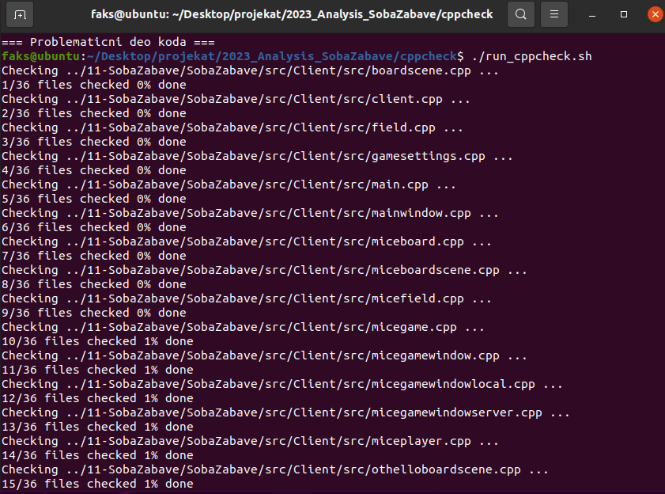
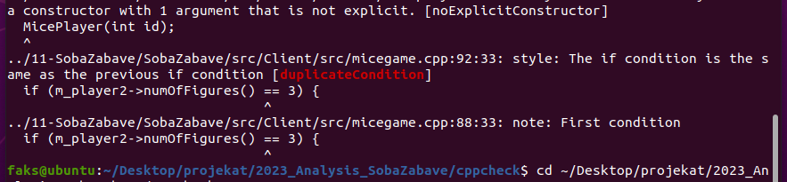
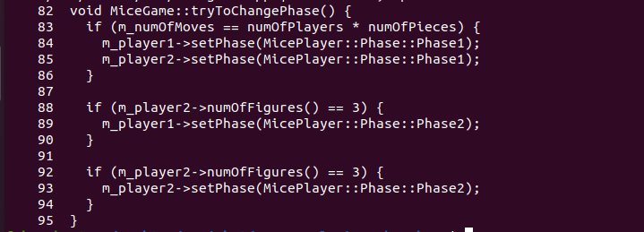
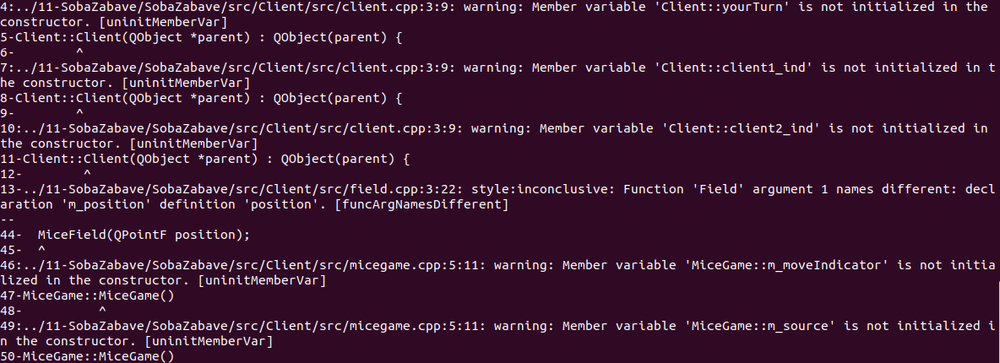
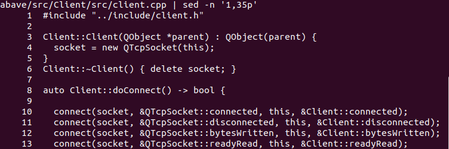
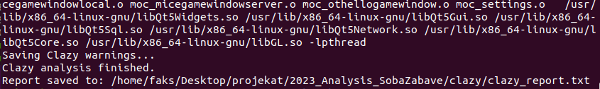
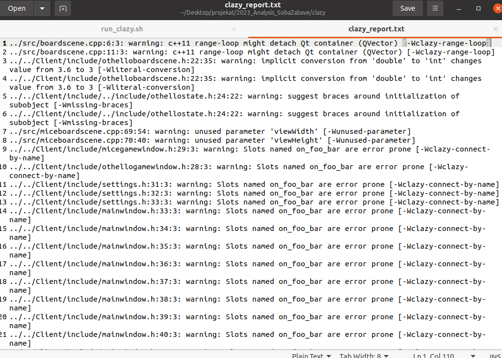
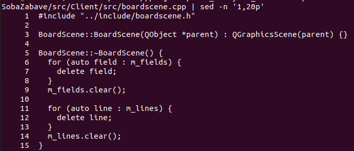

# Analiza projekta SobaZabave

## Sadržaj

1. [Uvod](#1-uvod)
2. [Statička analiza koda](#2-statička-analiza-koda)
   - 2.1 [Cppcheck](#21-cppcheck)
   - 2.2 Clazy
3. Testiranje i pokrivenost koda
4. Dinamička analiza — Sanitizers
5. Profilisanje performansi — Callgrind
6. Analiza kompleksnosti — Lizard
7. Zaključak

---

## 1. Uvod

U ovom radu prikazana je analiza projekta **SobaZabave** primenom različitih alata i tehnika za verifikaciju softvera. Projekat je razvijen u programskom jeziku C++ korišćenjem Qt radnog okvira, a nastao je u okviru kursa Razvoj softvera na Matematičkom fakultetu Univerziteta u Beogradu.

SobaZabave je aplikacija koja omogućava igranje dve igre — **Othello** i **Mice**. Igre se mogu igrati lokalno, protiv računara ili u multiplayer režimu. Projekat se sastoji od klijentskog i serverskog dela, a pored implementacije logike igara sadrži grafički korisnički interfejs i mrežnu komunikaciju.

Izvorni projekat dostupan je na adresi:

`https://gitlab.com/matf-bg-ac-rs/course-rs/projects-2021-2022/11-SobaZabave`

U okviru repozitorijuma za analizu originalni projekat je dodat kao Git podmodul. Analizirana je verzija projekta sa commit-a:

`b7cae8fb7cd0f705bed87ae4215824c71081000a`

Pre početka analize provereno je da projekat može uspešno da se prevede i pokrene.

Za analizu projekta biće korišćeno više alata i tehnika kojima će biti obuhvaćeni statička analiza koda, testiranje, dinamička analiza, profilisanje performansi i analiza kompleksnosti.

---

## 2. Statička analiza koda

Statička analiza koda omogućava pronalaženje potencijalnih problema bez pokretanja programa. Ovakvom analizom mogu se uočiti greške u kodu, korišćenje neinicijalizovanih promenljivih, sumnjive konstrukcije, kao i problemi koji se odnose na stil i kvalitet koda.

U okviru ovog rada za statičku analizu korišćeni su alati **Cppcheck** i **Clazy**.

---

## 2.1 Cppcheck

Prvi alat korišćen za analizu projekta je **Cppcheck**. U pitanju je alat za statičku analizu C i C++ koda koji može da pronađe potencijalne greške bez pokretanja programa. Pored grešaka, prijavljuje i različita upozorenja koja se odnose na stil i kvalitet koda.

Za analizu je korišćena verzija **1.90**.

Analiza je automatizovana skriptom `run_cppcheck.sh`:

```bash
#!/bin/bash

CPPCHECK_OPTIONS="--enable=all --inconclusive --suppress=missingIncludeSystem"

DIRECTORY_TO_CHECK="../11-SobaZabave/SobaZabave"

cppcheck $CPPCHECK_OPTIONS "$DIRECTORY_TO_CHECK" 2> cppcheck_report.txt
```

Opcija `--enable=all` uključuje sve grupe provera koje Cppcheck nudi, dok `--inconclusive` omogućava prikaz i rezultata za koje alat ne može sa potpunom sigurnošću da utvrdi da predstavljaju problem. Opcija `--suppress=missingIncludeSystem` korišćena je da se iz rezultata uklone upozorenja vezana za sistemska zaglavlja.

Rezultat analize čuva se u fajlu `cppcheck_report.txt`.



*Slika 1: Pokretanje Cppcheck analize*

### Duplirani uslov

Jedan od značajnijih rezultata analize je upozorenje `duplicateCondition`. Cppcheck je u fajlu `micegame.cpp` prijavio da se na linijama 88 i 92 nalazi isti uslov.



*Slika 2: Upozorenje za duplirani uslov*

Proverom prijavljenog dela izvornog koda vidi se da oba uslova proveravaju broj figura drugog igrača:

```cpp
if (m_player2->numOfFigures() == 3) {
    m_player1->setPhase(MicePlayer::Phase::Phase2);
}

if (m_player2->numOfFigures() == 3) {
    m_player2->setPhase(MicePlayer::Phase::Phase2);
}
```



*Slika 3: Deo funkcije `tryToChangePhase` sa dupliranim uslovom*

U prvom slučaju proverava se broj figura igrača `m_player2`, dok se faza menja igraču `m_player1`. U drugom slučaju i provera i promena faze odnose se na `m_player2`. Na osnovu ostatka implementacije faza igre, prvi uslov bi trebalo da proverava broj figura prvog igrača:

```cpp
if (m_player1->numOfFigures() == 3) {
    m_player1->setPhase(MicePlayer::Phase::Phase2);
}
```

Na ovaj način Cppcheck je ukazao na grešku u uslovu koja može da dovede do pogrešne promene faze prvog igrača.

### Neinicijalizovane promenljive

Cppcheck je prijavio i nekoliko članova klase `Client` koji nisu inicijalizovani u konstruktoru. U pitanju su promenljive `yourTurn`, `client1_ind` i `client2_ind`.



*Slika 4: Cppcheck upozorenja za neinicijalizovane članove klase `Client`*

Proverom konstruktora klase `Client` vidi se da se u njemu inicijalizuje objekat `socket`, dok navedeni članovi nemaju početne vrednosti.

```cpp
Client::Client(QObject *parent) : QObject(parent) {
    socket = new QTcpSocket(this);
}
```



*Slika 5: Konstruktor klase `Client`*

Neinicijalizovane promenljive mogu imati neodređene vrednosti sve dok im se eksplicitno ne dodeli vrednost, pa njihovo korišćenje pre dodele može dovesti do neočekivanog ponašanja programa. Zbog toga bi bilo bolje inicijalizovati ih prilikom konstrukcije objekta.

### Ostala upozorenja

Pored prethodno izdvojenih rezultata, Cppcheck je prijavio i veći broj upozorenja manjeg značaja. Neka od njih odnose se na konstruktore sa jednim argumentom koji nisu označeni kao `explicit`, funkcije koje bi mogle biti označene kao `const` ili `static`, kao i na nepotrebno kopiranje i promenljive čija se vrednost ne koristi.

Prijavljena su i upozorenja za još nekoliko neinicijalizovanih članova, među kojima su `m_moveIndicator`, `m_source` i `m_destination` u klasi `MiceGame`, kao i `m_numOfFigures` u klasi `Player`.

Deo prijavljenih rezultata odnosi se na stil i moguće poboljšanje kvaliteta koda i ne predstavlja nužno grešku u radu programa. Zbog toga su u prethodnim delovima detaljnije analizirana dva nalaza koja su ocenjena kao značajnija.

### Zaključak Cppcheck analize

Cppcheck analiza je pokazala više upozorenja različitog značaja. Pored preporuka vezanih za stil koda, pronađen je duplirani uslov u implementaciji igre Mice, čijom proverom je uočena greška u izboru igrača čiji se broj figura proverava. Takođe su pronađeni članovi klase `Client` koji nisu inicijalizovani u konstruktoru.

Ovi rezultati pokazuju da statička analiza može da ukaže na potencijalne probleme u kodu bez potrebe za pokretanjem same aplikacije.

---


## 2.2 Clazy

Drugi alat korišćen za statičku analizu je **Clazy**, statički analizator zasnovan na Clang-u koji je namenjen pronalaženju problema specifičnih za Qt aplikacije. U analizi je korišćena verzija **1.6**.

Clazy je pokrenut kao kompajler tokom izgradnje klijentskog dela projekta. Na taj način se analiza izvršava zajedno sa prevođenjem izvornog koda.

Za pokretanje analize korišćena je sledeća skripta:

```bash
#!/bin/bash

REPORT_FILE="$(pwd)/clazy_report.txt"
TEMP_REPORT="$(pwd)/temp_report.txt"

cd ../11-SobaZabave/SobaZabave/src/Client

echo "Cleaning old build..."
rm -rf build_clazy

echo "Removing old reports..."
rm -f "$REPORT_FILE"
rm -f "$TEMP_REPORT"

export CLAZY_CHECKS="level1"

mkdir build_clazy
cd build_clazy

echo "Running qmake with Clazy..."
qmake ../Client.pro QMAKE_CXX=clazy QMAKE_CC=clang

echo "Building project with Clazy analysis..."
make -j$(nproc) 2> "$TEMP_REPORT"

echo "Saving Clazy warnings..."
grep -E "warning:|clazy" "$TEMP_REPORT" > "$REPORT_FILE"

echo "Clazy analysis finished."
echo "Report saved to: $REPORT_FILE"
```

Kompletan izlaz analize čuva se u fajlu `temp_report.txt`, dok se izdvojena upozorenja čuvaju u fajlu `clazy_report.txt`.



### Iteriranje kroz Qt kontejnere

Clazy je prijavio upozorenja u fajlu `boardscene.cpp` na mestima gde se koristi range-based `for` petlja nad `QVector` kontejnerima:

```cpp
for (auto field : m_fields) {
    delete field;
}

for (auto line : m_lines) {
    delete line;
}
```

Alat upozorava da ovakav način iteriranja može dovesti do odvajanja (*detach*) Qt kontejnera i potencijalno nepotrebnog kopiranja podataka. Ovo upozorenje ne predstavlja nužno funkcionalnu grešku, već ukazuje na potencijalno neefikasno korišćenje Qt kontejnera.





### Implicitna konverzija tipova

Još jedno korisno upozorenje pronađeno je u fajlu `othelloboardscene.h`. U kodu se nalazi sledeća deklaracija:

```cpp
const int detailedPositioning = 3.6;
```

Promenljiva `detailedPositioning` deklarisana je kao `int`, dok joj se dodeljuje decimalna vrednost `3.6`. Prilikom implicitne konverzije decimalni deo se odbacuje, tako da vrednost promenljive postaje `3`.

Ukoliko je namera autora bila da se sačuva vrednost `3.6`, promenljiva bi mogla biti deklarisana korišćenjem tipa `double`:

```cpp
const double detailedPositioning = 3.6;
```

Ovaj nalaz predstavlja potencijalni gubitak preciznosti i pokazuje mesto u kodu koje bi trebalo dodatno proveriti u odnosu na nameravano ponašanje programa.

### Ostala upozorenja

Clazy je prijavio i veći broj upozorenja vezanih za Qt slotove čija imena odgovaraju obrascu `on_foo_bar`. Alat upozorava da ovakav način automatskog povezivanja signala i slotova može biti podložan greškama.

Pored toga, pronađena su upozorenja vezana za neiskorišćene parametre i način inicijalizacije pojedinih objekata. Ova upozorenja uglavnom predstavljaju preporuke za poboljšanje kvaliteta i održivosti koda i nisu detaljnije analizirana.

### Zaključak Clazy analize

Clazy analiza je pokazala nekoliko potencijalnih problema i preporuka specifičnih za Qt kod. Kao najzanimljiviji nalazi izdvojeni su potencijalno neefikasno iteriranje kroz Qt kontejnere i implicitna konverzija vrednosti `3.6` u celobrojni tip. Projekat je tokom Clazy analize uspešno preveden, a pronađena upozorenja ukazuju na mesta u kodu koja bi mogla biti unapređena.

---

## 3. Testiranje i pokrivenost koda

*Ovo poglavlje biće dopunjeno nakon analize postojećih i dodatih testova i merenja pokrivenosti koda.*

---

## 4. Dinamička analiza — Sanitizers

*Ovo poglavlje biće dopunjeno nakon analize.*

---

## 5. Profilisanje performansi — Callgrind

*Ovo poglavlje biće dopunjeno nakon analize.*

---

## 6. Analiza kompleksnosti — Lizard

*Ovo poglavlje biće dopunjeno nakon analize.*

---

## 7. Zaključak

*Zaključak će biti dodat nakon završetka svih analiza.*
